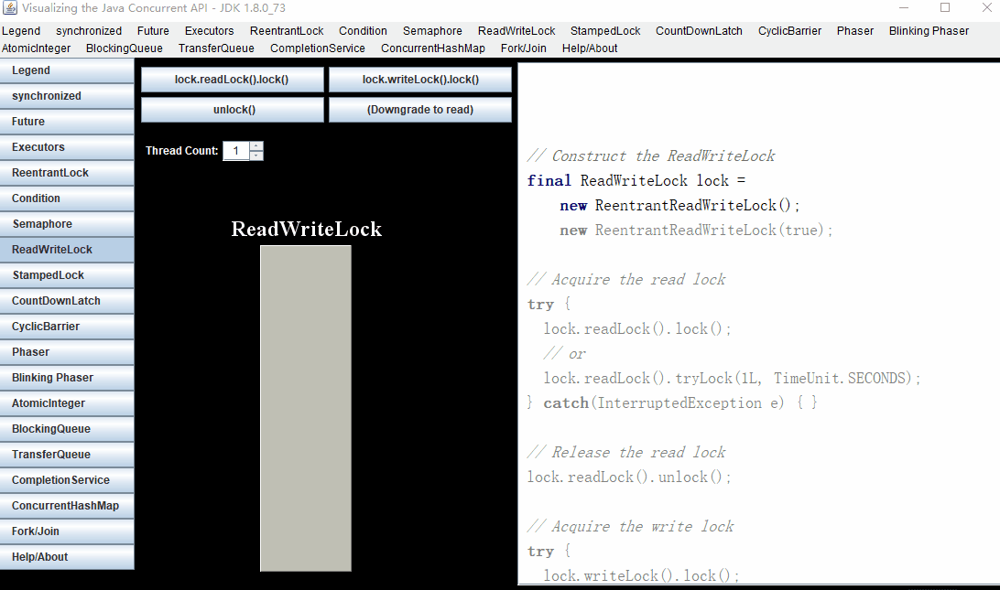
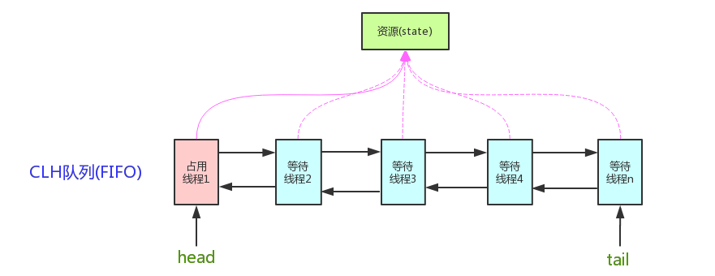
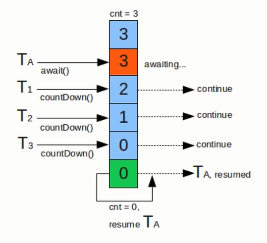
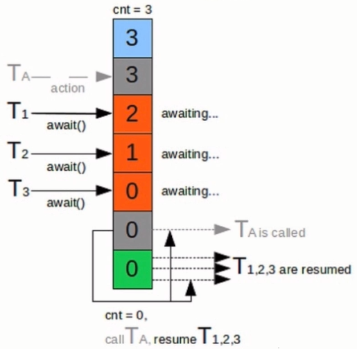
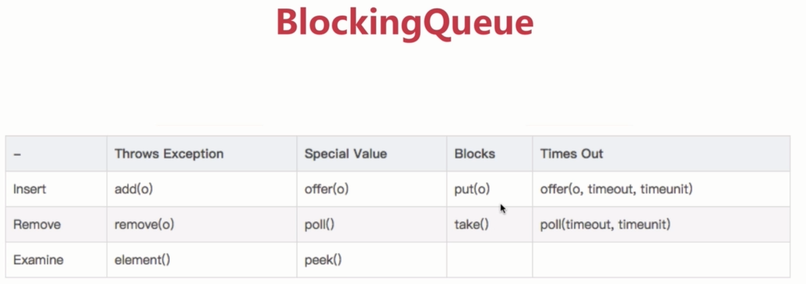

# 高并发
慕课网高并发实战[课程](https://coding.imooc.com/class/195.html?mc_marking=b587280c0c1c0e76c1092aa21406565a&mc_channel=syb6)，平时学习的时候很少会接触到高并发这一模块，即使
接触到也只是一些概念上的东西，和企业实际开发中的使用可能会有很大的出入通过这门课程的学习来和企业开发中的并发做对接

## 高并发动画
动画展示JUC包下的各个组件，有助理解，建议一边学习课程的时候一边使用该程序模拟，可以从官方下载，也可以从本项目中下载，jar包放在source文件夹下，下载成功之后，使用java -jar命令运行即可

> 官方网址：http://sourceforge.net/projects/javaconcurrenta/
> 
> 下载地址：http://sourceforge.net/projects/javaconcurrenta/files/latest/download?source=files



## 高并发目录
<!-- MarkdownTOC -->

- 线程安全性
- 线程安全策略
- 线程封闭
- 线程不全类和写法
- 安全发布对象
- 同步容器
- 并发容器J.U.C
- 安全共享对象策略
- AQS-AbstractQueuedSynchronizer
    - CountDownLatch 计数器
    - Semaphore 信号量
    - CyclicBarrier
        - 简介
- ReentrantLock\(Synchronized\)的区别
    - 可重入性
    - 锁的实现
    - 性能的区别
- ReentrantLock独有的功能
- ReentrantLock方法
- ReentrantReadWriteLock
- Synchronized
- BlockQueue
- Synchronized的优点
- Future和FutureTask
- 正确发布对象
- 线程池
- 死锁

<!-- /MarkdownTOC -->

## 线程安全性
1. 原子性：提供了互斥访问，同一时刻只能有一个线程来对他进行访问
2. 可见性：一个线程对主内存的修改可以及时的被其他线程观察到
3. 有序性：一个线程观察其他线程中的指令执行顺序，由于指令重排序的存在，该观察结果一般杂乱无序

CAS源码解析
``` java
    //var1操作对象，var2值在内存中的偏移地址，var4加上的值
    public final int getAndAddInt(Object var1, long var2, int var4) {
        //主存中的值
        int var5;
        //循环判断，一直等到其他线程同步到主存中
        do {
            //获取主存中最新的值
            var5 = this.getIntVolatile(var1, var2);
            //compareAndSwapInt native方法，判断当前的值和主存的值是否相等，是的话就进行var5 + var4
        } while(!this.compareAndSwapInt(var1, var2, var5, var5 + var4));
        return var5;
    }
```

## 线程安全策略
不可变对象：
1. 对象创建以后其状态不能修改
2. 对象所有域都是final
3. 对象是正确创建的（在对象创建期间，this引用没有逸出）

## 线程封闭
1. Ad-hoc线程封闭：程序控制实现最糟糕，忽略
2. 堆栈封闭：局部变量，无并发问题
3. ThreadLocal线程封闭：特别好的封闭方法

## 线程不全类和写法
1. StringBuilder：线程不安全
2. StringBuffer：线程安全，append使用synchronized

## 安全发布对象
+ 发布对象：使一个对象能够被当前范围之外的代码使用
+ 对象逃逸：一种错误的发布对象，当一个对象还没有构造完成时，就使它被其他线程所见。

## 同步容器
1. ArrayList -> Vector,Stack
2. HashMap -> HashTable
3. Collections.synchronizedXXX(Map,List,Set)

## 并发容器J.U.C
ArrayList -> CopyOnWriteArrayList：添加元素的时候会拷贝原来的数组，然后将数组引用指向新的数组对象
> 1. 在数组内容给常大的情况下不建议使用（yong gc，full gc）
> 2. 适合读多写少的场景
> 3. 读写分离的设计思想
> 4. 数据最终一致性，不能保证数据的实时一致性
> 5. 使用批量操作，每次添加都会复制新的数组 
> 6. [编发编程网-COW](http://ifeve.com/java-copy-on-write/)

HashSet、TreeSet -> CopyOnWriteArraySet、ConcurrentSkipListSet

HashMap、TreeMap -> ConcurrentHashMap、ConcurrentSkipListMap
> 1. ConcurrentHashMap一定条件下性能优于ConcurrentSkipListMap
> 2. ConcurrentSkipListMap key有序
> 3. ConcurrentSkipListMap存取时间和线程数没有关系，意味着在线程数特别多的时候性能比ConcurrentHashMap高

## 安全共享对象策略
1. 线程限制：一个被线程限制的对象，由线程独占，并且只能被它占有的线程修改 -> 线程封闭
2. 共享只读：一个共享只读的对象，在没有额外同步的情况下，可以被多个线程并发访问，但是任何线程都不能修改它 -> 不可变对象
3. 线程安全对象：一个线程安全的对象或者容器，在内部通过同步机制来保证线程的安全，所以其他线程无需额外的同步就可以通过公共接口随意访问它 -> 同步容器
4. 被守护对象：被守护对象只能通过获取特定的锁来访问 -> 同步容器


## AQS-AbstractQueuedSynchronizer
> 核心实现图



1. 使用Node实现FIFO队列，可以用于构建锁或其他同步装置的基础框架
2. 利用一个int类型表示状态
3. 使用方法是继承
4. 子类通过继承并通过实现它的方法管理其状态{acquire和relase}的方法操纵状态
5. 可以同时实现排它锁和共享锁模式（独占和共享）

AQS同步组件
+ CountDownLatch
+ Semaphore
+ CyclicBarrier
+ **ReentrantLock**
+ Condition
+ FutureTask

### CountDownLatch 计数器



1. 线程阻塞辅助类，调用await方法会阻塞当前线程，等到计数器为0的时候才会继续执行下面的代码
2. await(option time) 阻塞线程，time为指定时间，如果未完成直接结束任务
3. countDown() 计数器减一

### Semaphore 信号量


1. **控制并发访问的线程个数**，在某些个场景线程并发数过高，可以使用信号量来控制一下并发
2. acquire() 获取许可，只有拿到许可才可以执行
3. release() 释放许可
4. traAcquire() 尝试获取许可

### CyclicBarrier 
#### 简介
CyclicBarrier 的字面意思是可循环使用（Cyclic）的屏障（Barrier）。
它要做的事情是，让一组线程到达一个屏障（也可以叫同步点）时被阻塞，
直到最后一个线程到达屏障时，屏障才会开门，所有被屏障拦截的线程才会继续干活。
CyclicBarrier默认的构造方法是CyclicBarrier(int parties)，其参数表示屏障拦截的线程数量，
每个线程调用await方法告诉CyclicBarrier我已经到达了屏障，然后当前线程被阻塞。[来源：并发编程网](http://ifeve.com/concurrency-cyclicbarrier/)


1. 和CountDownLatch一样通过计数器来实现线程阻塞，但是它可以重置计数器，达到多次使用，CountDownLatch是一次性的
2. 作用和CountDownLatch相反，阻塞工作线程，每次工作线程调用await方法则计数器加一，当计数器达到指定值时才会继续执行
3. 多个线程相互等待，直到满足条件的时候，所有线程才会继续进行后续的操作

## ReentrantLock(Synchronized)的区别
### 可重入性
### 锁的实现
ReentrantLock依赖JDK实现
Synchronized依赖JVM实现
### 性能的区别
在Synchronized没有引入偏向锁以及轻量级锁（自旋锁）的时候性能比ReentrantLock低，但是引入之后基本上差不多
## ReentrantLock独有的功能
+ 可指定是公平锁还是非公平锁，Synchronized是公平锁
+ 提供了一个Condition类，可分组唤醒需要唤醒的线程
+ 提供能够中断等待锁的线程的机制，lock.lockInterruptibly()
## ReentrantLock方法
+ lock()加锁
+ unlock()释放锁，一般在finally里面使用
+ tryLock() 仅在调用时锁定未被另一个线程保持的资源才会锁定资源
+ tryLock(time) 在指定的时间内等待未被另一个线程锁定的资源，且线程未被中断才会锁定
## ReentrantReadWriteLock
> 读写锁，大多应用于缓存的场景，缓存是一种多读少写的场景，在进行数据一致性操作的时候不能使用
悲观锁实现，这样的话在更新数据的时候所有读取都将会进入等待状态，这个时候就需要使用到读写分离锁

缺点：由于写锁只有在没有读锁的情况下才会锁定，所以在读的情况非常多的情况下会造成写饥饿
## Synchronized
1. 修饰代码块：大括号括起来的代码，作用于调用的对象
2. 修饰方法：整个方法，作用于调用的对象
3. 修饰静态方法：整个静态方法，作用于所有对象
4. 修饰类，括号括起来的部分，作用于所有对象
## BlockQueue

1. ArrayBlockingQueue
2. DelayQueue
3. LinkedBlockingQueue
4. PriorityBlockingQueue
5. SynchronousQueue
## Synchronized的优点
+ 简单易用
+ 永远不用关心释放锁的操作
## Future和FutureTask
带有返回值的异步执行,FutureTask是Future升级版本，较为容易使用

## 正确发布对象

1. 在静态初始化函数中初始化一个对象引用
 ```java
 //推荐使用，线程安全而且还不会造成资源的浪费
public class SingletonEnum {

    public static SingletonEnum getInstance() {
        return Singleton.INSTANCE.getInstance();
    }

    private enum Singleton {
        INSTANCE;
        private SingletonEnum singleton;

        Singleton() {
            singleton = new SingletonEnum();
        }

        public SingletonEnum getInstance() {
            return singleton;
        }
    }
}
 ```
2. 将对象的引用保存到volatile类型域或者AtomicReference对象中
3. 将对象的引用保存到某个正确构造对象的final类型域中
4. 将对象的引用保存到一个由锁保护的域中

## 线程池

线程池优点：
1. 重用存在的线程，减少对象的创建，消亡的开销，性能佳
2. 可有效控制最大并发线程数，提高系统资源利用率，同时可以避免过多资源竞争，避免阻塞
3. 提供定时执行，定期执行，单线程，并发控制等功能

Thread弊端：
1. 每次new Thread新建对象，性能差
2. 线程缺乏统一管理，可能无限制的新建线程，相互竞争，有可能占用过多的系统资源
3. 缺少更多的功能，如多执行，定期执行，线程中断

ThreadPoolExecutor
+ corePoolSize：核心线程数量
+ maximumPoolSize：线程最大线程数
+ workQueue：阻塞队列，存储等待执行的任务，很重要，会对线程池运行过程产生重大影响
+ keepAliveTime：线程池没有任务执行时最多保持多长时间
+ unit：keepAliveTime的时间单位
+ threadFactory：线程工厂，用来创建线程
+ rejectHandler：拒绝处理任务时的策略

当使用submit或execute方法时的逻辑判断
1. 首先如果运行的线程数小于corePoolSize，则会创建新的线程，即使线程池中的其他线程是空闲的也会创建，
2. 如果线程池中的线程数量大于等corePoolSize&&小于等于maximumPoolSize的时候，只有当workQueue满的
时候才会创建新的线程处理任务
3. 如果线程数大于maximumPoolSize并且workQueue满了则会采用拒绝策略

线程池实例状态
1. RUNNING：可以接受任务或处理队列中的任务
2. SHUTDOWN：
3. STOP：
4. TIDYING：
5. TERMINATED：

线程池常用方法
execute()：提交任务，交给线程池执行
submit()：提交任务，能够返回执行结果execute + Future
shutdown()：关闭线程池，等待任务都执行完成
shutdownNow()：关闭线程池，不等待任务执行完成

getTaskCount()：线程池**已经执行和未执行**的总数
getCompletedTaskCount()：已经完成的任务数量
getPoolSize()：线程池当前的线程数量
getActiveCount()：当前线程池中正在执行任务的线程数量

Executor框架接口
+ Executors.newCachedThreadPool：创建一个可缓存的线程池，如果处理任务超过当前线程数则创建线程，如果没有则回收空闲线程
> new ThreadPoolExecutor(0, Integer.MAX_VALUE, 60L, TimeUnit.SECONDS, new SynchronousQueue<Runnable>())
+ Executors.newFixedThreadPool：创建一个定长的线程池(coorPoolSize=maximumPoolSize)，可以控制线程最大并发数，如果任务超出线程池数量则会在队列中等待
> new ThreadPoolExecutor(nThreads, nThreads, 0L, TimeUnit.MILLISECONDS, new LinkedBlockingQueue<Runnable>())
+ Executors.newScheduledThreadPool：创建一个定长，定时，周期性的线程池
> new ScheduledThreadPoolExecutor(corePoolSize) => super(corePoolSize, Integer.MAX_VALUE, 0, NANOSECONDS, new DelayedWorkQueue())
+ Executors.newSingleThreadExecutor：创建一个单线程化的线程池，可以保证任务按照一定的顺序执行（先进先出，优先级），如果当前线程异常则会创建一个新的线程完成任务
> new ThreadPoolExecutor(1, 1, 0L, TimeUnit.MILLISECONDS, new LinkedBlockingQueue<Runnable>())

线程池参数配置
+ CPU密集型任务，需要尽量压榨CPU，参数可设置为NCPU+1
+ IO密集型任务，参考值可以设置为2*NCPU

## 死锁
1. 互斥条件
2. 请求和保持条件：线程保持一个资源，有发出另一个资源的请求
3. 不剥夺条件
4. 循环等待条件

解决方案
+ 加锁顺序一致：在案例中可以使flag=0和flag=1两种情况下的加锁顺序保持一致
+ 使用lock进行强制释放锁
+ 死锁检测（难实现）
